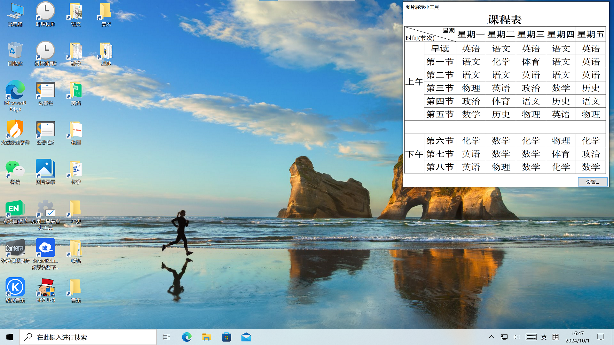
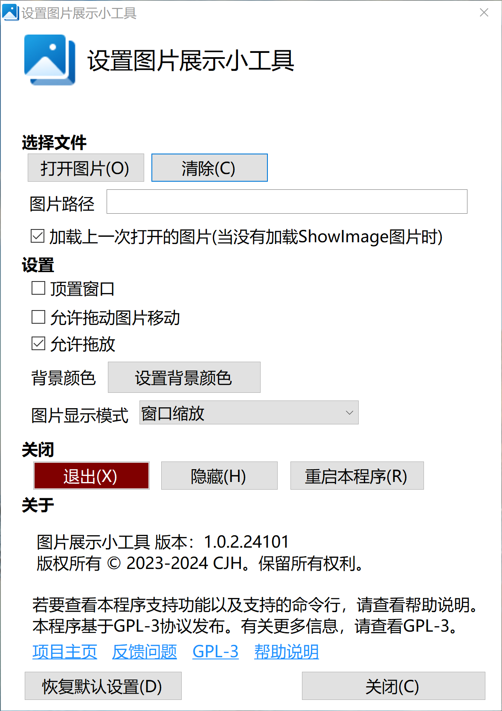

# IBoard - 图片展示小工具

## 关于本项目

这是一个可以将一张或多张图片展示在屏幕上的工具。本软件可以安装在大屏上（例如教学大屏），也可以安装在普通电脑上。

## 功能

本程序支持的功能有：

- [x] 展示图片（基础功能）
- [x] 一系列可以自定义的设置，支持通过将图片拖放到程序窗口方便地打开图片
- [x] 可以自动启动，并且自动加载上一次打开的图片（或者程序启动目录的`ShowImage`名称图片）
- [x] 可以通过双击图片隐藏/显示窗口框架
- [x] 支持通过组策略配置策略

## 下载

转到[发布页](https://github.com/cjhdevact/IBoard/releases)下载程序或源代码。

早期版本的源代码也在发布页里。

## 程序截图

### 主程序界面

### 设置界面

## License

本程序基于`GPL-3.0`协议授权。