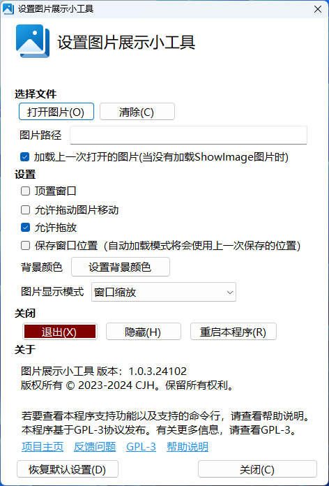

<h1 align="center">
  <a href="https://github.com/cjhdevact/IBoard">IBoard - 图片展示小工具</a>
</h1>

## 关于本项目

这是一个可以将一张或多张图片展示在屏幕上的工具。本软件可以安装在大屏上（例如教学大屏），也可以安装在普通电脑上。

## 功能

本程序支持的功能有：

- [x] 展示图片（基础功能）
- [x] 一系列可以自定义的设置，支持通过将图片拖放到程序窗口方便地打开图片
- [x] 可以自动启动，并且自动加载上一次打开的图片（或者程序启动目录的`ShowImage`名称图片）
- [x] 可以通过双击图片隐藏/显示窗口框架
- [x] 支持通过组策略配置策略
- [x] 适配DPI缩放（适配高分屏）

## 下载

转到[发布页](https://github.com/cjhdevact/IBoard/releases)下载程序或源代码。

早期版本的源代码也在发布页里。

## 数字签名

本程序使用了自签证书进行了签名

证书信息：
```
Name: CJH Root Certificate
Create: ‎2024‎年‎12‎月‎27‎日 20:42:16
Expires: ‎2150‎年‎12‎月‎31‎日 0:00:003e5
MD5: 0bc507db70947e57ddd81bec63b581d9
SHA256: d2d67c8ebea3cc954c7ee0e94f5f45537dde7709053ca9e89f352fda60283
Key fingerprint (SHA1): 73b80a8d0ba3f662b575f2fc0b78612469e22e59
KeyID: d929e453f645017190dac5001a736a4d
Certificate SerialNumber: dbde77418068d5a34b2064626a12ecde
Key Type: md5RSA
```

你可以在[这里](Src/IBoard/files/rootcert.cer)下载证书来验证程序完整性。

## 程序截图

### 主程序界面


### 设置界面



## 相关项目

[UsefulControl](https://github.com/cjhdevact/UsefulControl) - 实用小工具的整合项目（包括本项目的功能）

## License

本程序基于`GPL-3.0`协议授权。